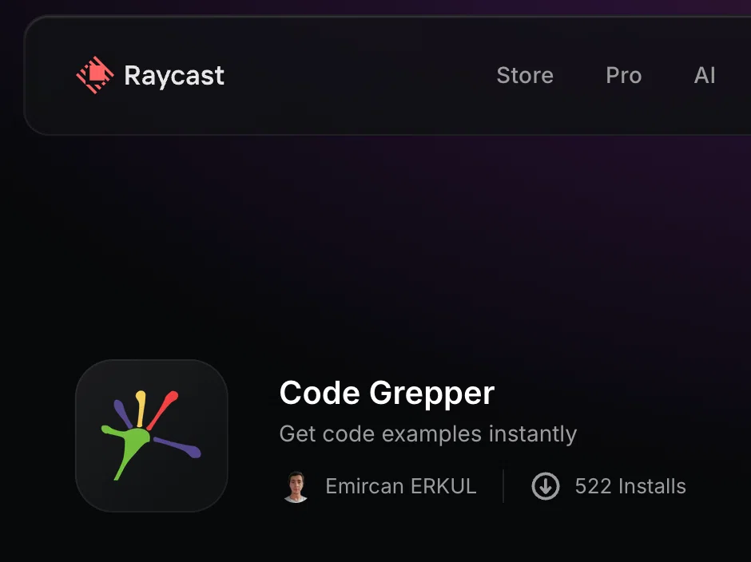
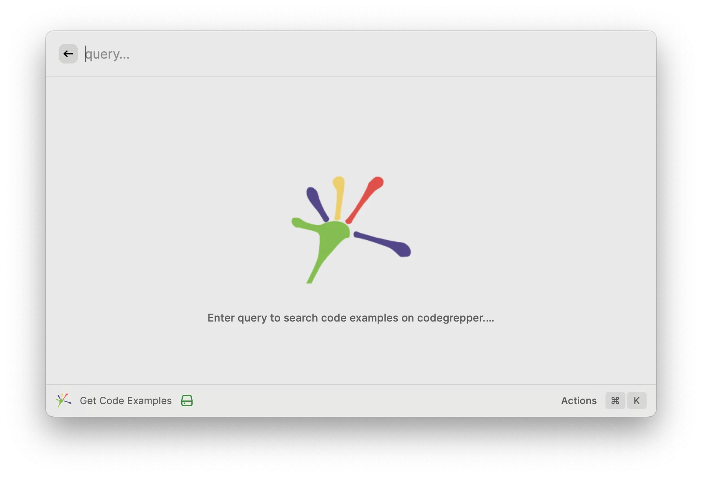
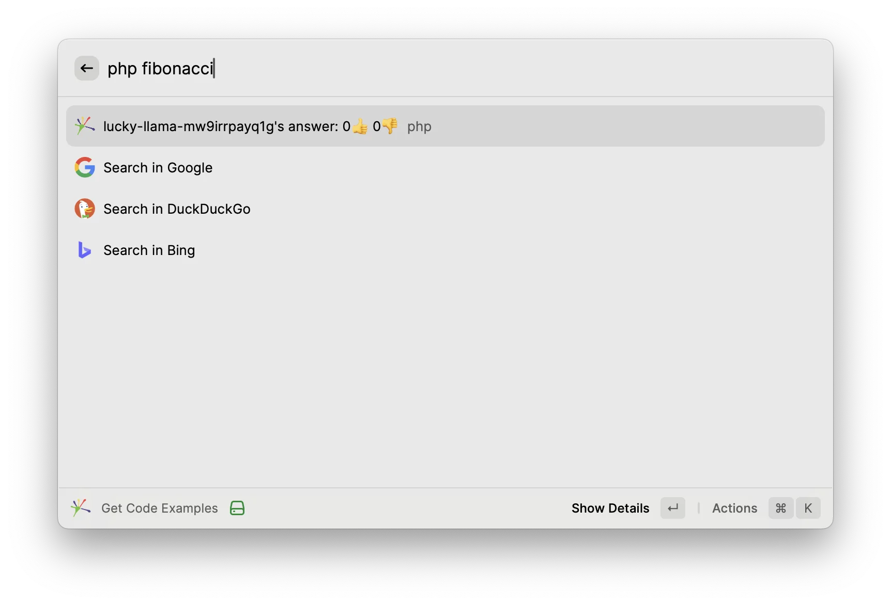
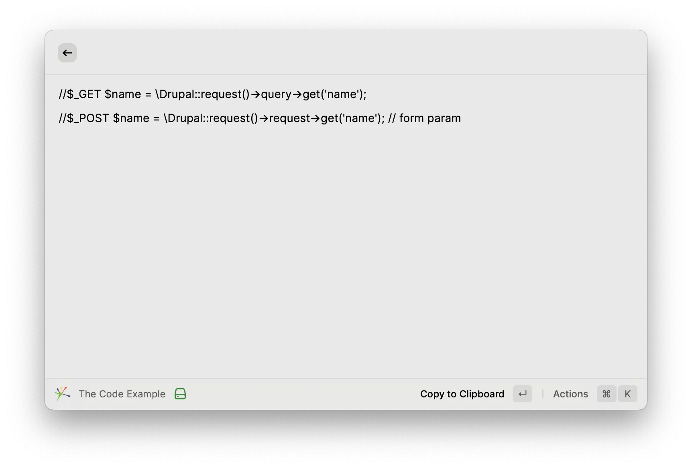
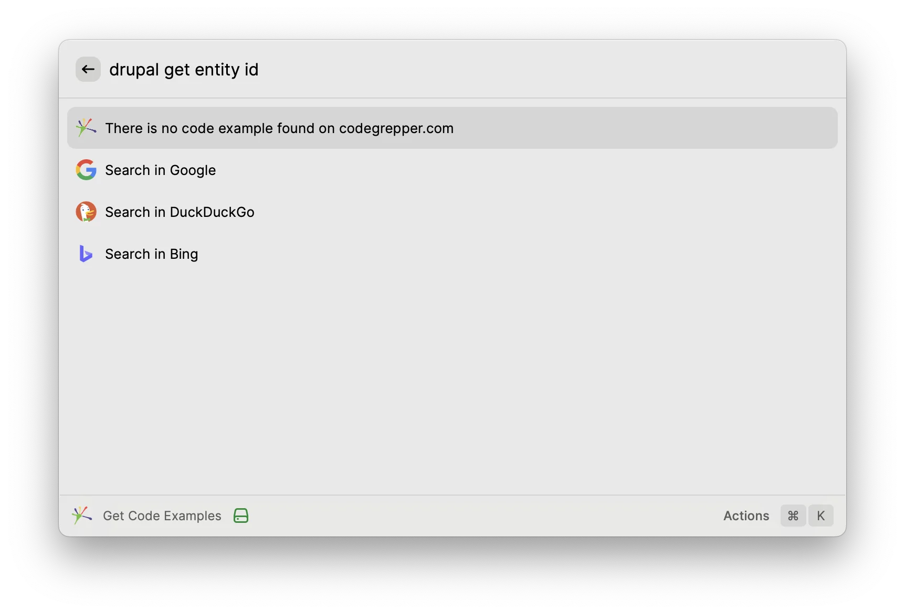

# Code Grepper

> [!WARNING]
> **This extension is broken — CodeGrepper is dead.**
> [codegrepper.com](https://www.codegrepper.com) has been shut down: the site and its public API
> (`https://www.codegrepper.com/api/get_answers_1.php`), which this extension used to fetch code
> examples, now simply redirect to [you.com](https://you.com) and no longer return any data.
> Because of this, the extension can no longer return any code examples.
> The project is kept here for archival purposes only.

Get code examples instantly, right from [Raycast](https://www.raycast.com).

Code Grepper was a Raycast extension that searched [CodeGrepper](https://www.codegrepper.com) and
listed code examples with a detail view, so you could grab a snippet without ever leaving the
launcher.

## On the Raycast Store

Code Grepper was published on the official Raycast Store:



## Screenshots

| Empty search | Search results |
| :---: | :---: |
|  |  |
| **Code example detail** | **No results found** |
|  |  |

## Features

- 🔍 Search code examples on CodeGrepper straight from Raycast
- ⚡ Live results as you type, with request throttling and caching
- 📝 Detail view rendering snippets as Markdown
- 📋 Copy any example to your clipboard
- 🔗 Visit the author's profile or donate to them
- 🌐 Fallback **Search in Google / DuckDuckGo / Bing** actions when nothing was found

## Thank you 💚

Code Grepper was installed **over 500 times** through the Raycast Store — thank you to
**everyone** who ever used it! 🎉

Every search, every copied snippet and every upvote counted. Knowing that hundreds of developers
opened Raycast, typed a query, and got a working piece of code back without opening a single
browser tab is exactly why this extension was built.

If you were one of those 522 users: consider this repository a small thank-you note addressed to
you. 🙏

## Development

> The extension no longer works — see the warning above. These instructions are kept for reference.

```bash
npm install
npm run dev     # start developing the extension
npm run build   # production build
npm run lint    # lint and fix
```

## License

MIT — see [package.json](package.json).
