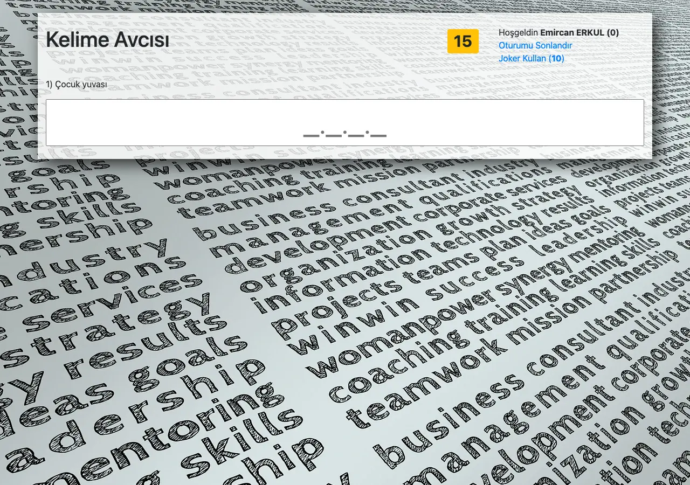
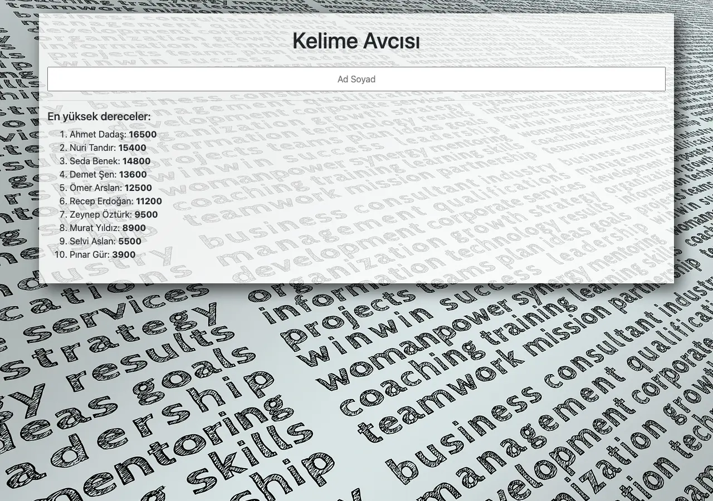

# Kelime Avcısı (Keyword Hunter)

A Turkish word-guessing quiz game built with plain PHP, MySQL and Bootstrap 4.



## How it works

Enter a name to start. The game then asks seven rounds of questions drawn from a
question bank, and each round is harder than the last:

1. **Round 1 to 7** — every round draws a random question whose answer has
   `level + 3` characters, so round 1 hides a 4-letter answer and round 7 hides a
   10-letter one.
2. **Answer** — type the answer and submit. A correct answer scores 100 points
   per character, so a longer answer is worth more.
3. **Timer** — each round allows 30 seconds. The counter turns red for the last
   10 seconds and reloads the page when it runs out.
4. **Joker** — 10 jokers are available for the whole game; each one reveals a
   single letter of the current answer.
5. **Finish** — after round 7 the final score is written to the high-score board,
   which keeps the top 10 players.

Wrong answers reveal the correct one, and an unanswered round is a miss. Either
way you advance to the next question.



## Features

- Session-based game state; no framework and no build step
- Random question selection per round from a MySQL question bank
- Score scaled by answer length
- Countdown timer per question
- Letter-reveal joker with a limited budget
- Persistent top-10 high-score board in `high-scores.json`
- XHTML templates separated from the logic

## Requirements

- PHP 7.4 or later (the bundled DDEV config pins 7.4; it also runs on PHP 8)
- The `pdo_mysql` and `session` extensions
- MySQL or MariaDB

## Setup

### With DDEV (recommended)

The repository includes `.ddev/config.yaml`, which pins PHP 7.4 with Apache,
MariaDB 10.11 and a router port of 8080:

```bash
ddev start
ddev import-db --src=default.sql
```

The site is then served at `http://localhost:8080`. DDEV provides the
`host=db` database host that `index.php` expects.

### With any PHP server

Create a database and import the question bank:

```bash
mysql -u root -p -e "CREATE DATABASE default CHARACTER SET utf8mb4"
mysql -u root -p default < default.sql
```

`index.php` connects using `host=db`, `dbname=default`, user `root` and
password `root`. Point the `db` host at your database service, then serve the
project root as the document root:

```bash
php -S 0.0.0.0:8080 -t .
```

### Security

`.htaccess` denies web access to `default.sql` and every `*.json` file so the
question bank and the high-score board cannot be read over HTTP.

## Project structure

```
index.php                entry point and all game logic
action.php               logout and joker actions
template/
  login.xhtml            name entry and the high-score list
  question.xhtml         in-game screen: question, timer, joker, answer input
  result.xhtml           feedback after answering
  final.xhtml            end-of-game summary
assets/
  css/main.css           layout and background
  js/main.js             countdown timer behaviour
  img/back.webp          background image
default.sql              question bank dump (table `q`)
high-scores.json         top 10 scores
.ddev/config.yaml        local DDEV environment
.htaccess                blocks direct access to default.sql and *.json
```

## The question bank

`default.sql` creates a single table `q` with `question` and `answer` columns.
51 questions ship with the project.

Answers are selected on character length, `CHAR_LENGTH(answer) = level + 3`, so
every one of the seven rounds finds a match. Answers span 4 to 10 characters:

| Characters | 4 | 5 | 6 | 7 | 8 | 9 | 10 |
|---|---|---|---|---|---|---|---|
| Questions | 8 | 7 | 8 | 8 | 7 | 7 | 6 |

Note that the score uses `strlen`, which counts bytes rather than characters,
so answers containing Turkish characters such as `ş`, `ç` or `ğ` (two bytes each
in UTF-8) are worth slightly more than their character count suggests.

## License

Released under the [MIT license](LICENSE).
