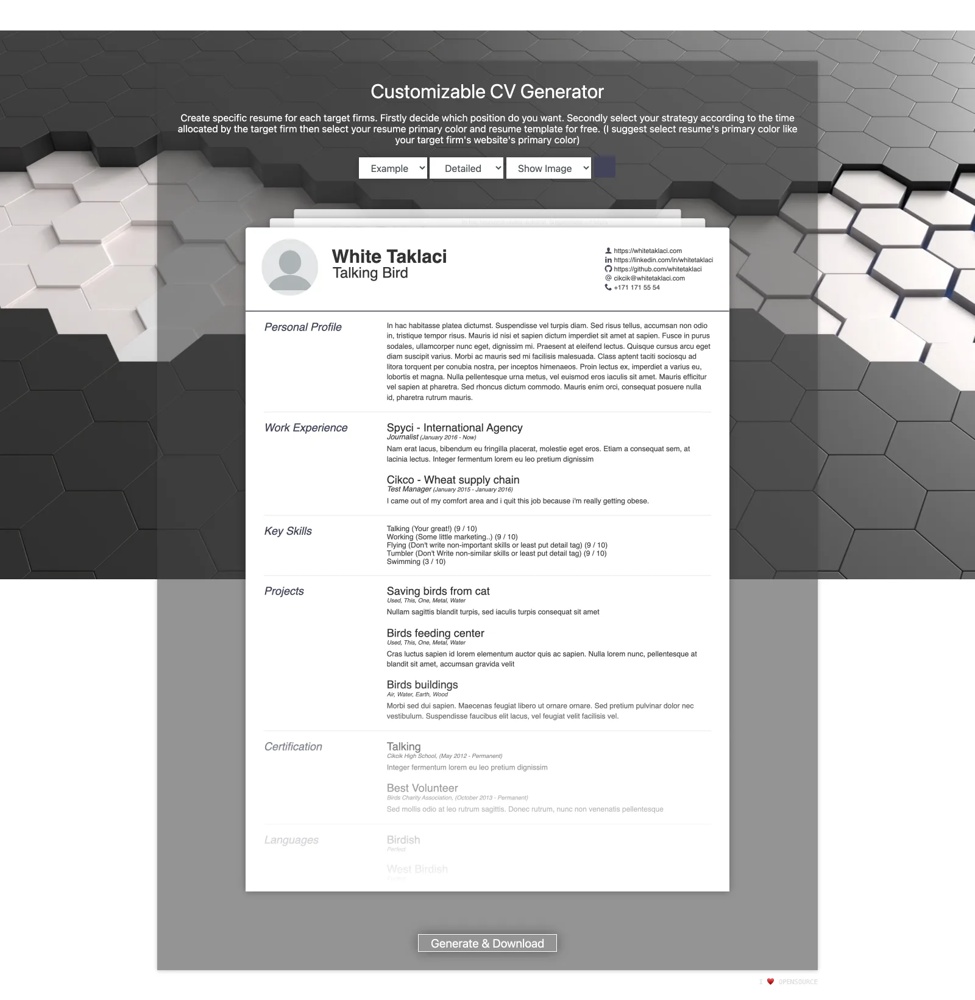

# Customizable CV Generator

Tailor a resume for every application. Pick a profile, a level of detail (strategy), an accent color, and a template — the preview updates live, and **Generate & Download** produces a ready-to-send PDF via [wkhtmltopdf](https://github.com/wkhtmltopdf/wkhtmltopdf).



## Contents

- [Requirements](#requirements)
- [Docker (suggested)](#docker-suggested)
- [Traditional installation](#traditional-installation)
- [Usage](#usage)
- [Profile file — CVGen schema](#profile-file--cvgen-schema)
- [Profile file — tagging](#profile-file--tagging)
- [Template engine](#template-engine)
- [Project layout](#project-layout)
- [Building the Docker image](#building-the-docker-image)
- [Acknowledgements](#acknowledgements)
- [License](#license)

## Requirements

- **Docker** (or a compatible engine such as Podman) — recommended
- *or* a classic web stack (XAMPP, WAMP, plain Apache + PHP) with [wkhtmltopdf](https://github.com/wkhtmltopdf/wkhtmltopdf) installed

> **Note:** The historical `php:5.6-apache` base image no longer builds: Debian *stretch* is EOL (its apt repositories have been archived) and its bundled wkhtmltopdf `.deb` is amd64-only. Use the Docker instructions below — the image is now based on Ubuntu 24.04 LTS, works on both amd64 and Apple Silicon (arm64), and ships Apache 2.4, PHP 8.3, and wkhtmltopdf 0.12.6.

## Docker (suggested)

```bash
docker build --build-arg BUILD_DATE=$(date -u +'%Y-%m-%dT%H:%M:%SZ') -t cvgen:latest .
docker run -d --name cvgen -p 8000:8000 cvgen:latest
```

Then open **http://localhost:8000**.

The image is self-contained: the application is copied in at build time, so no volume mount is required. It serves the app on port **8000** inside the container (as well as 80), which is what you should publish — port 80 is only reachable with root privileges on rootless setups such as Podman.

### Podman

```bash
podman build --build-arg BUILD_DATE=$(date -u +'%Y-%m-%dT%H:%M:%SZ') -t cvgen:latest .
podman run -d --name cvgen -p 8000:8000 cvgen:latest
```

### Traditional installation

- Install [wkhtmltopdf](https://github.com/wkhtmltopdf/wkhtmltopdf)
- Download the [repository](https://github.com/emircanerkul/other/archive/refs/heads/project/cvgen.zip) and place it in your local web server's document root
- Create your `profile.json` file (see the schema below)

## Usage

1. Pick a **profile** from the dropdown — a sample `Example` profile is included to get you started.
2. Choose a **strategy**: *Important* shows the short version of tagged texts and lower-rated skills; *Detailed* shows everything.
3. Decide whether to **show or hide** the profile photo.
4. Pick a **primary color** (a color matching the target firm's brand works nicely).
5. Click a template card to preview the result live.
6. Hit **Generate & Download** to produce the PDF.

## Profile file — CVGen schema

Profiles live in `data/profiles/` as JSON files; the file name becomes the profile name in the UI (a leading `[EN] Example.json` is treated as an internal example and hidden from the list). Translation strings live in `data/translation.json` (`en` / `tr`).

```json
{
    "@context": "http://github.com/emircanerkul/cvgen",
    "@type": "CVGen",
    "lang": "en",
    "name": "String",
    "surname": "String",
    "expertise": "String",
    "born": "String",
    "gender": "String",
    "email": "String@email",
    "website": "String@url",
    "linkedin": "String@url",
    "github": "String@url",
    "phone": "String",
    "photo": "String@filename",
    "about": {
        "detailed": "String@LongText",
        "important": "String@ShortText"
    },
    "education": [
        {
            "organization": "String",
            "department": "String",
            "degree": "String",
            "date_at": "String@year",
            "date_from": "String@year"
        }
    ],
    "experience": [
        {
            "organization": "String",
            "qualification": "String",
            "date_at": "String@date",
            "date_from": "String@date",
            "excerpt": "String@ShortText"
        }
    ],
    "certificate": [
        {
            "organization": "String",
            "qualification": "String",
            "date_at": "String@date",
            "date_from": "String@date",
            "excerpt": "String@shortText"
        }
    ],
    "abilities": [
        {
            "ability": "String",
            "level": 9
        }
    ],
    "projects": [
        {
            "title": "String",
            "excerpt": "String",
            "used": "String"
        }
    ],
    "languages": [
        {
            "title": "String",
            "qualification": "String"
        }
    ],
    "hobbies": [
        {
            "title": "String",
            "icon": "String@icon:[study,pen,music1]",
            "excerpt": "String"
        }
    ]
}
```

Photos referenced by `photo` go into `data/images/`.

## Profile file — tagging

Tagged content is what the *strategy* selector switches between — *Important* keeps only the short versions, *Detailed* shows everything.

- To tag a **variable**, turn it into an object with `detailed` / `important` variants:

```json
"about": {
    "detailed": "More detailed long text here",
    "important": "Short text here"
}
```

- To tag an **object inside an array**, add a `tag` value to it:

```json
"certificate": [
    {
        "organization": "String",
        "qualification": "String",
        "date_at": "String@date",
        "date_from": "String@date",
        "excerpt": "String@shortText",
        "tag": "detailed"
    }
]
```

Array entries can also carry a numeric `level` (as in `abilities`): with the *Important* strategy, anything with `level <= 6` is filtered out.

## Template engine

Templates are plain HTML files in `templates/`; anything the engine understands is expressed with `I%=…` / `…=%I` style markers:

- Language variable: `I&=VARKEY1=&I` (resolved against `data/translation.json`)
- Profile variable: `I%=VARKEY2=%I`
- Profile array loop: starts with `I%=VARKEY3=I` and ends with `I=VARKEY3=%I`

```html
I%=experience=I
<article>
    <h2>I%=organization=%I</h2>
    <p class="sub-details">
        <span>I%=qualification=%I</span>
        (I%=date_at=%I - I%=date_from=%I)
    </p>
    <p class="excerpt">I%=excerpt=%I</p>
</article>
I=experience=%I
```

## Project layout

```
├── index.html            # UI: selectors, live template previews, generate button
├── core/
│   ├── cvgen.php         # profile/template scanning, compiling, PDF generation
│   └── ajax.php          # JSON endpoints: profile_list, template_list, template, generate
├── templates/            # HTML resume templates (basic, wide, ribbed)
├── data/
│   ├── profiles/         # your CVs as JSON (one file per profile)
│   ├── images/           # profile photos
│   └── translation.json  # UI + resume strings per language
└── assets/               # css, js, icons, background video
```

## Building the Docker image

`BUILD_DATE` is an optional build arg baked into the image labels:

```bash
docker build --build-arg BUILD_DATE=$(date -u +'%Y-%m-%dT%H:%M:%SZ') -t cvgen:latest .
```

Runtime notes:

- `data/profiles/` and `data/images/` are baked into the image. To iterate on profiles without rebuilding, mount them over the baked copies: `-v $(pwd)/data/profiles:/var/www/html/data/profiles`
- The generated `resume.pdf` is written to the document root by the web server user (`www-data`), which the image sets up for you.
- Logs: `docker logs cvgen`, or `docker exec cvgen tail -f /var/log/apache2/error.log`.

## Acknowledgements

- [Ashish Kulkarni](https://github.com/ashkulz) & [Jakob Truelsen](https://github.com/antialize) and [others](https://github.com/wkhtmltopdf/wkhtmltopdf/graphs/contributors) for [wkhtmltopdf](https://github.com/wkhtmltopdf/wkhtmltopdf)
- [Thomas Hardy](http://www.thomashardy.me.uk) for the [HTML resume template](http://www.thomashardy.me.uk/free-responsive-html-css3-cv-template)
- [Simon](https://github.com/Simonwep/) for the [Pickr color picker](https://github.com/Simonwep/pickr)
- [webloopshub](https://pixabay.com/tr/users/webloopshub-12869313/?tab=videos) from [Pixabay](https://pixabay.com/videos/3d-rendering-movement-design-24717/) for the background video
- [IcoMoon](https://icomoon.io) for icons
- [Icons8](https://icons8.com) for the favicon

## License

[](http://badges.mit-license.org)
